# MHC Frontend Developer Test using Redux & Redux-Thunk (by Hendri Agustino)

This project is a coding test / developer test which I did for MHC. This is a frontend web application which consists of communication with a live database.

**Project Scope** :
- Design and develop a web application that will facilitate the online management of doctors, clinics and network. 
- All of which requires CRUD menus that have responsible and appropriate validations (e.g. names should not have numbers, etc.)
- There should be an admin login (you can use the User APIs to create via Postman – note when creating password – its bcrypt 10 cycles – and login via your frontend). 
- Admins will then land on a dashboard of a few numbers, e.g. Total Number of Providers, Total Number of Personnel, Total Number of Doctors. On the left, there should be a navigation pane with these headers – Dashboard (with the numbers), Personnel Manager, Provider Manager, Facilities Manager. 
- The admin can then view a list of Personnel in the Personnel Manager and delete / view more / create more. Same goes for all the other managers.

# Snapshots of Web App 
## First when running the application, we will be directed to the login form / authentication page
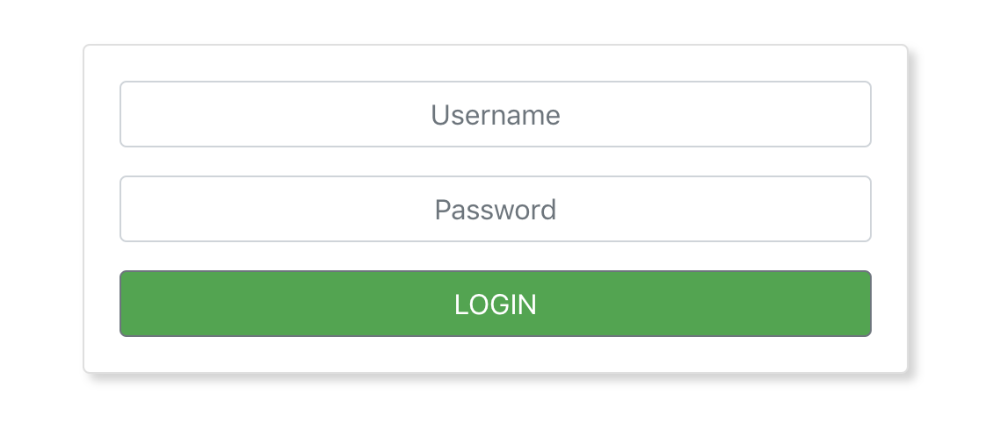

## Whenever we visit any links other than this login form and if we are still unauthenticated, we will be redirected to this "Eror 404 page"
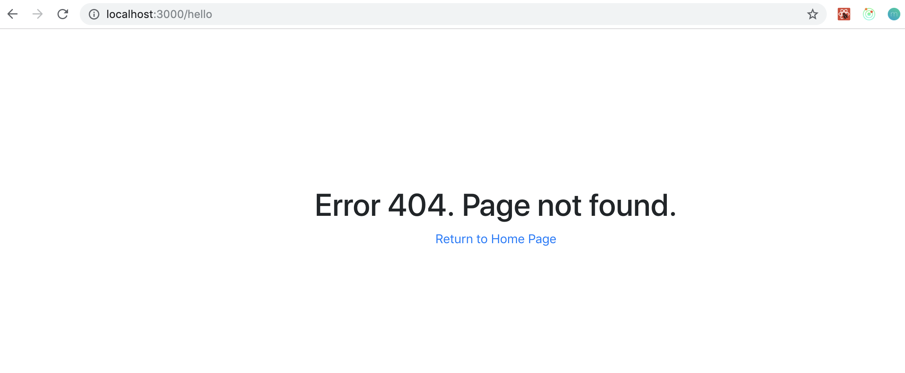

## Below is the Dashboard after logging in. Here we can see a series total number of Providers, Personnels, and Doctors
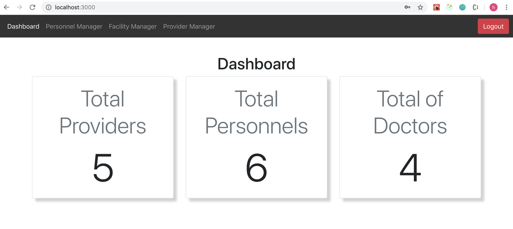

## Personnel Manager page contains all the personnel(s) in the database, on this page we can Add Personnel, View Personnel and Delete Personnel
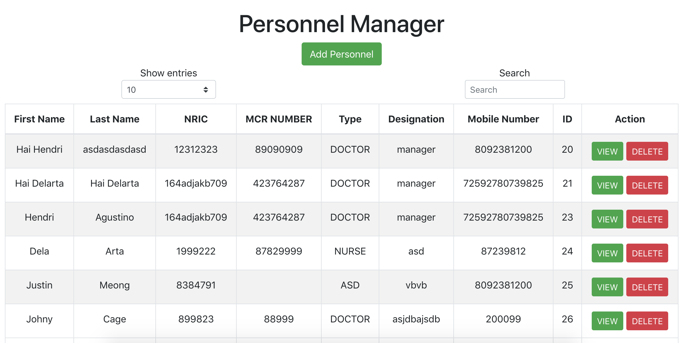

## Adding Personnel Form (not yet working)

## View Personnel Page
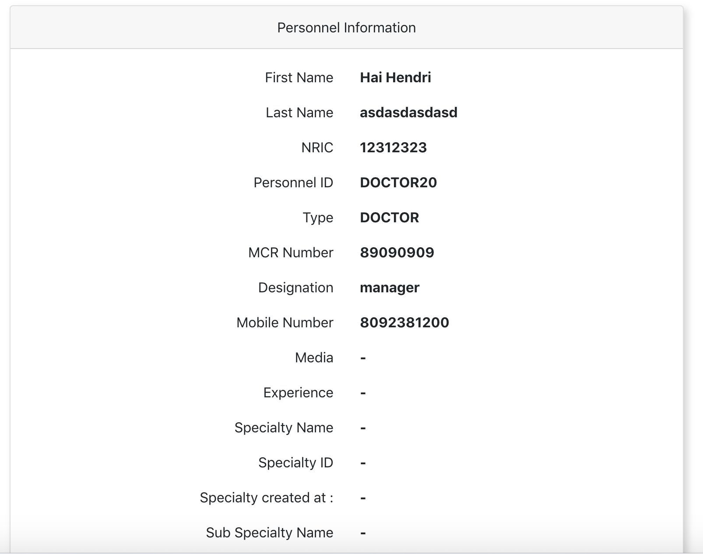

## Delete Personnel confirmation modal (clicking yes will then execute deletion of a personnel data)
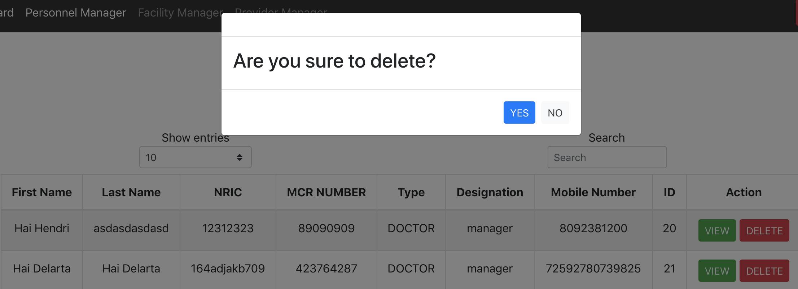

## Facility Manager page contains all the facilities in the database, on this page we can Add Facility, View Facility and Delete Facility
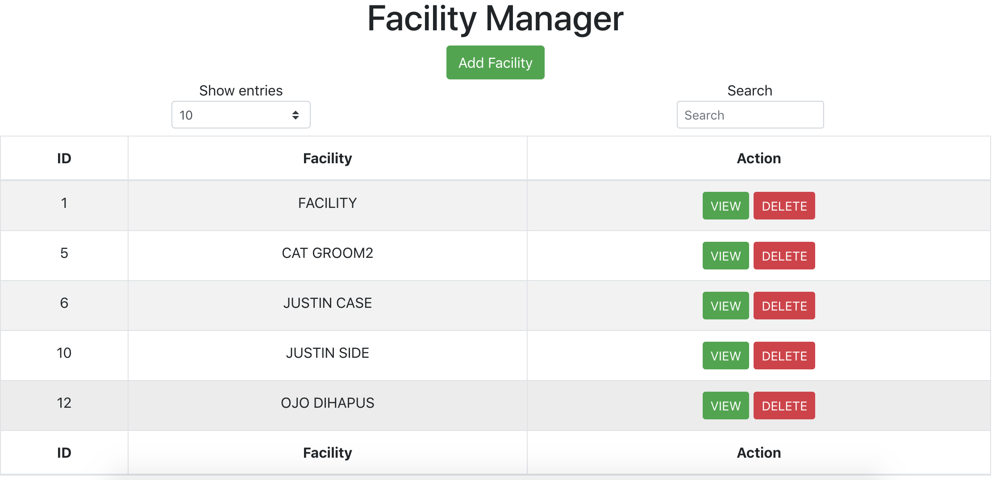

## Adding Facility Form (not yet working)
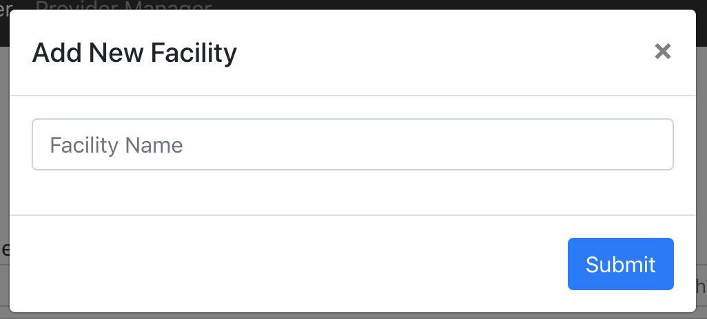

## View Facility Page
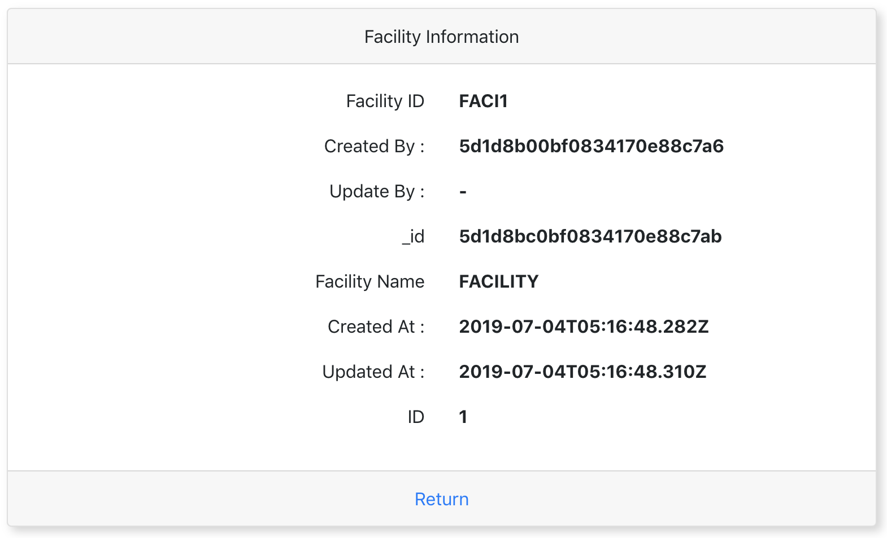

## Delete Facility confirmation modal (clicking yes will then execute deletion of a facility data)
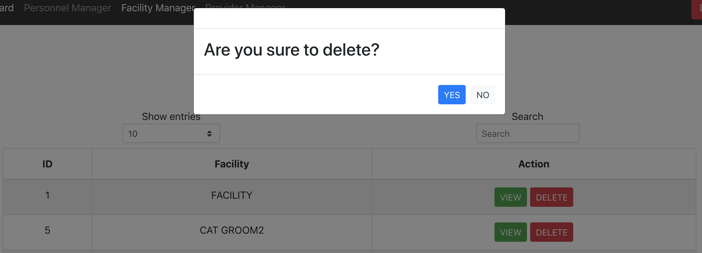

## Provider Manager page contains all the facilities in the database, on this page we can Add Provider, View Provider and Delete Provider
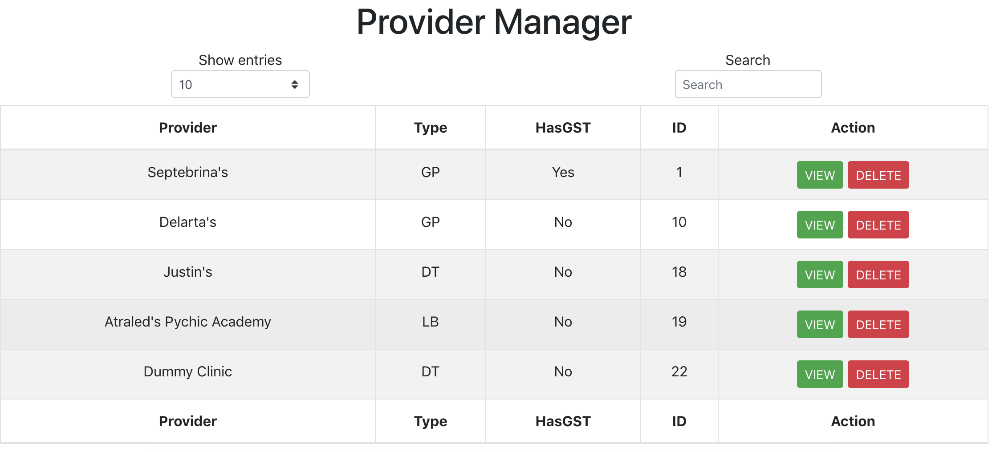

## Adding Provider Form (not yet working)

## View Provider Page
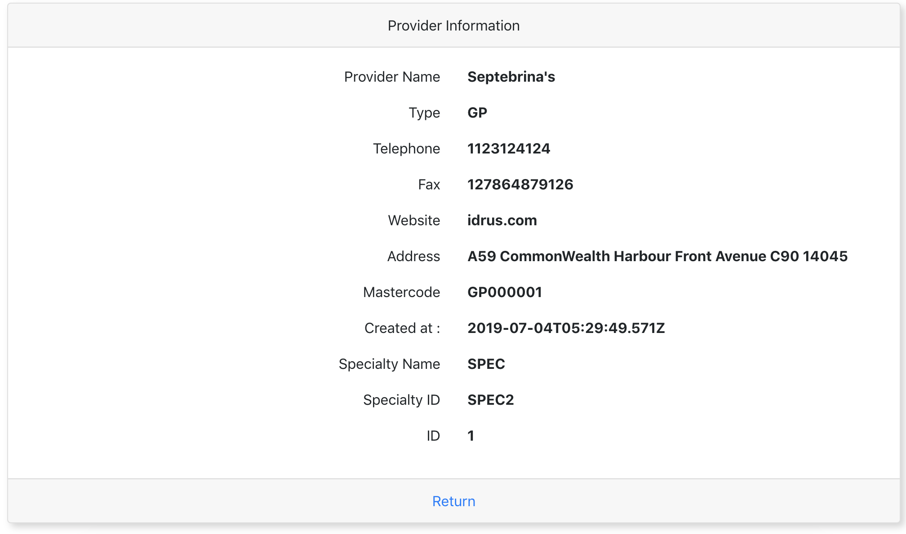

## Delete Provider confirmation modal (clicking yes will then execute deletion of a provider data)
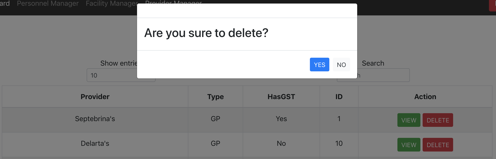

## Logout button to finish user session
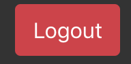

# Installation Instructions
## REQUIREMENTS

For development, you will need to install `Node.js` on your environment.

#### Node installation on OS X

1. Open the Terminal App and type brew install node.
2. Wait while Homebrew helps you download and install all the needed files for you to use.

After installing, you can check whether Node.js has been installed by typing `node-v` in terminal. Also to see if NPM is installed already, by typing `npm -v`

#### Node installation on Linux

On terminal, type in : 
`sudo apt-get install nodejs`

#### Node installation on Windows 

Go to [https://nodejs.org/en/download/](https://nodejs.org/en/download/) and follow all the steps to download.

## INSTALL

`$ git clone git@github.com:hendriagustino/mhc-frontend-test.git` 
`$ cd mhc-frontend-test` 
`$ npm install`

# START 

`$ npm start`
